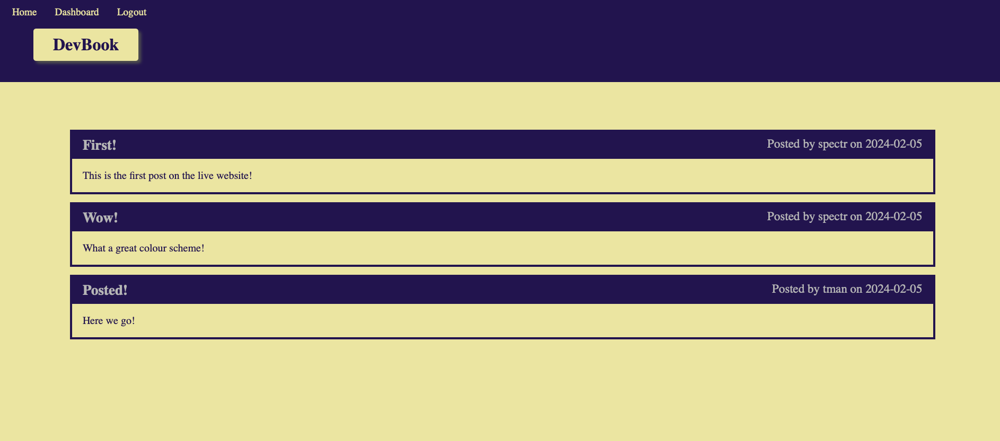

# devbook

## Description

A CMS-style blog styled after modern social media app models, with accounts, posts, comments, etc., meant to demonstrate usage of express-handlebars to manage views, on top of established technology skillsets.

## Usage 

Left-click the following link to visit 
[devbook]() hosted on Heroku, or right click to copy the URL and paste it into your browser. <!-- Click the button to enter the app, and enter a note title and text content, before clicking the save note button to save your note, which will appear in the sidebar on the left-hand side of the page on all platforms. Click the red trash can button next to an individual note in the sidebar to delete that note permanently. -->

## Technologies

### Heroku
### Handlebars
### Express
### Node.js
### JavaScript
### HTML
### CSS

## Credits & Sources

Information and documentation used in the creation of this app, but external to the EdX UofT Full-Stack Software Development Bootcamp including syntaxes, best practises and instructional examples for usage came from the following sources:

- 

## License

See LICENSE file in repository